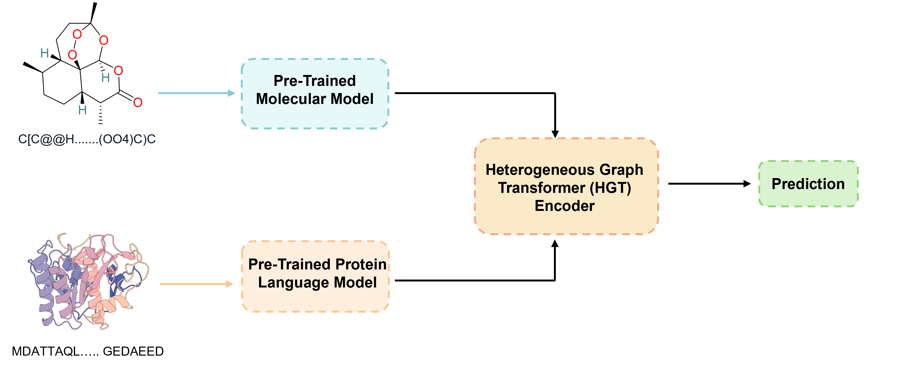
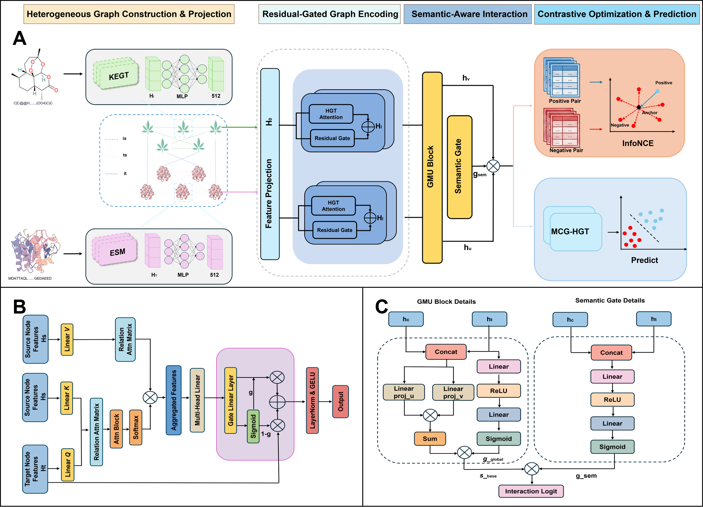

# MCG-HGT

## Introduction



MCG-HGT is a multimodal heterogeneous graph framework for herbal
ingredient-target interaction prediction. It integrates pre-trained molecular
and protein representations, a similarity-augmented heterogeneous graph,
Heterogeneous Graph Transformer (HGT) encoding, residual/semantic gates, and a
gated bilinear scorer.



## Files

```text
code/                  model, training, inference, and utility scripts
data/                  data availability note and HIT release manifest
overview.png           graphical overview
architecture.png       model architecture figure
requirements.txt       Python dependencies
environment.yml        Conda environment
```

Full HIT preprocessed inputs and pretrained MCG-HGT checkpoints are available
from the `v1.0.0` release assets:

https://github.com/jjjsun4-design/MCG-HGT/releases/tag/v1.0.0

## Environment

```bash
conda env create -f environment.yml
conda activate mcg-hgt
```

or:

```bash
python -m pip install -r requirements.txt
```

## Usage

Train MCG-HGT on HIT CVS1 with the publication defaults:

```bash
python code/main.py
```

Run inference:

```bash
python code/inference.py
```

Use a custom pair list or output file with:

```bash
python code/inference.py --pairs path/to/pairs.csv --output outputs/scores.csv
```

## Citation

If you use MCG-HGT, please cite the accompanying manuscript and this repository.

```bibtex
@software{mcg_hgt_2026,
  title = {MCG-HGT: Multimodal Heterogeneous Graph Learning for Herbal Ingredient-Target Interaction Prediction},
  author = {Sun, Jiehui and Li, Jinyu},
  year = {2026},
  url = {https://github.com/jjjsun4-design/MCG-HGT}
}
```

## License

This repository is released under the MIT License.
