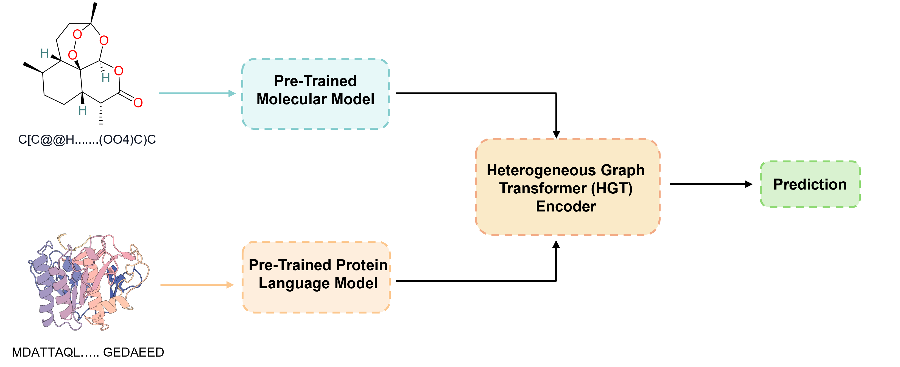
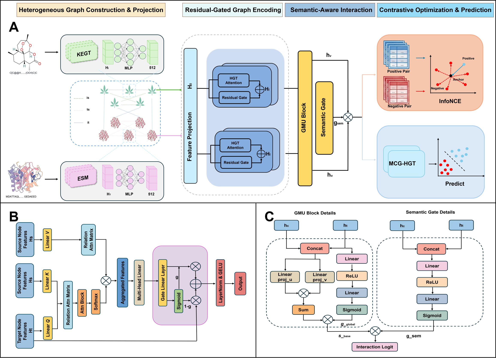

# MCG-HGT

## Introduction



MCG-HGT is a multimodal heterogeneous graph framework for herbal
ingredient-target interaction prediction. It integrates pre-trained molecular
and protein representations, a similarity-augmented heterogeneous graph,
Heterogeneous Graph Transformer (HGT) encoding, residual/semantic gates, and a
gated bilinear scorer.



## Files

```text
code/                  model, training, inference, and utility scripts
data/                  data availability note and HIT release manifest
overview.png           graphical overview
architecture.png       model architecture figure
requirements.txt       Python dependencies
environment.yml        Conda environment
```

## Environment

The publication experiments were conducted with Python 3.8 and the package
versions reported in Supporting Information Table S4. The current repository
is also compatible with the newer supported Python environment specified in
the supplied environment files.

Install the supplied environment or the Python requirements:

```bash
conda env create -f environment.yml
conda activate mcg-hgt
```

or:

```bash
python -m pip install -r requirements.txt
```

## Usage

Run the HIT 2.0 CVS1 workflow with the manuscript-aligned default
configuration:

```bash
python code/main.py
```

Select another evaluation protocol with `--cv_mode`, for example:

```bash
python code/main.py --cv_mode CVS4
```

Run inference:

```bash
python code/inference.py --checkpoint path/to/checkpoint.pt \
  --pairs path/to/pairs.csv --output outputs/scores.csv
```

## Citation

If you use MCG-HGT, please cite the accompanying manuscript and this repository.

```bibtex
@software{mcg_hgt_2026,
  title = {MCG-HGT: Multimodal Heterogeneous Graph Learning for Herbal Ingredient-Target Interaction Prediction},
  author = {Sun, Jiehui and Wang, Jiao and Cai, Wen and Sun, Yuhao and Liang, Tian and Wu, Juhong and Liu, Di and Gao, Ping and Feng, Xianmin and Li, Jinyu},
  year = {2026},
  url = {https://github.com/jjjsun4-design/MCG-HGT}
}
```

## License

This repository is released under the MIT License.
